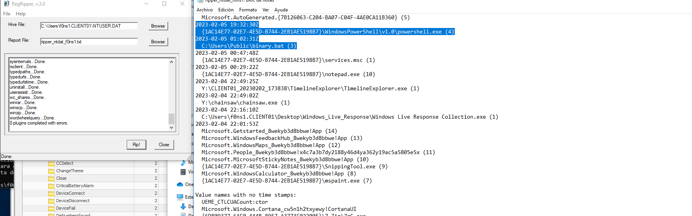

# INDEX OF CONTENT

  1.[RECOLECTION AND EXTRACTION](#recolection-and-extraction)
  
  2.[DUMP EVTX FROM MACHINE](#dump-evtx-from-machine)
  
  3.[REVIEW AND EXPLORE EVTX](#review-and-explore-evtx)
  
  4.[PARSE EVTX](#parse-evtx)
  
  5.[REVIEW PARSED EVTX GUI](#review-parsed-evtx-gui)
  
  6.[REVIEW AND EXTRACT HIVES](#review-and-extract-hives)
  
  7.[REVIEW REGISTRY](#review-registry)

# RECOLECTION AND EXTRACTION

[Windos Response Collection](https://www.brimorlabs.com/Tools/LiveResponseCollection-Cedarpelta.zip)


```
.\Windows Live Response Collection.exe
```


# DUMP EVTX FROM MACHINE

Wevtutil belogn to windows operative system binaries:
```
PS C:\Windows\system32> wevtutil el | ForEach-Object {   $file=$_.Replace(resources/"/","_"); wevtutil.exe epl $_ "Y:\CLIENT01_202
30202_173838\DUMP_ALL_EVTX\$file.evtx" }

```

# REVIEW AND EXPLORE EVTX

[chainsaw](https://github.com/WithSecureLabs/chainsaw)

Hunting for anomaly option:

```
./chainsaw hunt /home/f0ns1/shared_windows/CLIENT01_20230202_173838/DUMP_ALL_EVTX/ 
```

Search by event option:
```
 1865  ./chainsaw search /home/f0ns1/shared_windows/CLIENT01_20230202_173838/DUMP_ALL_EVTX/ -e 4688 |  grep -B 4 -A 4 "\\\cmd.exe" | wc -l

```

# PARSE EVTX

[EvtxCmd Zimmerman tools](https://f001.backblazeb2.com/file/EricZimmermanTools/EvtxECmd.zip)
```
PS Y:\chainsaw>  Get-ChildItem -Path Y:\CLIENT01_20230202_173838\DUMP_ALL_EVTX\ | Select Name | ForEach-Object { $file =
 $_.Name;.\EvtxECmd\EvtxECmd.exe -f Y:\CLIENT01_20230202_173838\DUMP_ALL_EVTX\$file --csv "Y:\CLIENT01_20230202_173838\"
 --csvf $file.Replace(resources/"evtx","csv") }
```
```
 Z:\EvtxECmd\EvtxECmd.exe -f Z:\PSSession_.evtx --csv Z:\ --csvf PSSesion.csv
```


# REVIEW PARSED EVTX GUI
[TimeLine Explorer Zimmerman tool](https://f001.backblazeb2.com/file/EricZimmermanTools/TimelineExplorer.zip)
```
.\TimelineExplorer
```

# REVIEW AND EXTRACT HIVES  
[Reg Ripper 3.0](https://github.com/keydet89/RegRipper3.0)



# REVIEW REGISTRY
[RegistryExplorer Zimmerman tool](https://f001.backblazeb2.com/file/EricZimmermanTools/RegistryExplorer.zip)


