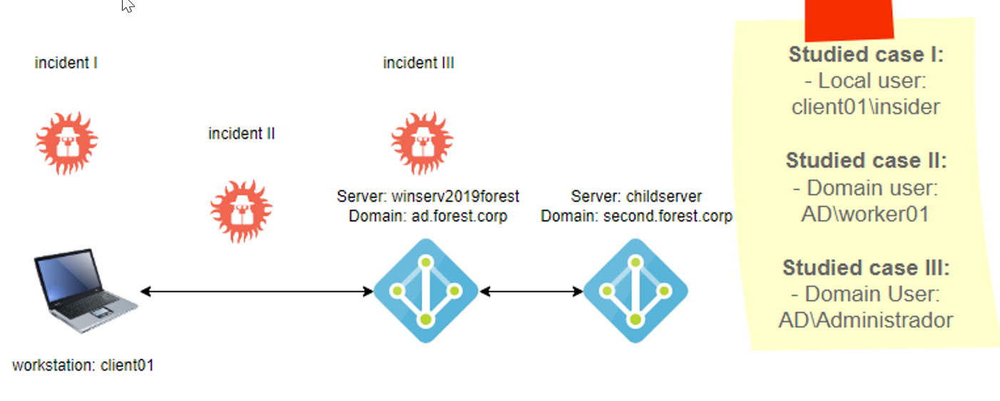

# Workshop 01



## Table of contents 

 1. [Studied case I](#studied-case-i)
 2. [Studied case II](#studied-case-ii)
 3. [Studied case III](#studied-case-iii)
 4. [Apendix A](#apendix-a)
 5. [Forensics tools](#forensics-tools)


# Studied case I
## 1. Local machine [CLIENT01] that belong to AD Forest DC [ad.forest.corp Machine] 
## 1.1 Exploitation
```
1.1.1 localuser: insider:Passw0rd1 [login]

1.1.2 Execution of enumeration scripts with powershell and bypass Windows Defender 
    using Invishell [5.PowerUp] [4.powerView] [3.powershell] [2.Invishell] [1.cmd] 

1.1.3 Privilege escalation: 
    Abuse of privileges: creation of new user with local system adminsitrator privileges: f0ns1
    and bypass Windows Defender using Invishell [Install-servicebinary] [4.PowerUp] [3.powershell] [2.Invishell] [1.cmd]

```
[AD computer Local privilege escalation (resources/video) ](https://youtu.be/uI0GjO3BYuI)

[AD computer Local privilege escalation (resources/writeup) ](Exploit_case_1.md)

## 1.2 DETECTION 

[ Attack Detection ](use_case_I_detection.md) 

# Studied case II
## 2. Lateral movement from localmachine to Domain controller
## 2.1 Exploitation
```
2.1.1 Dump credentials with user f0ns1 and obtain NTLM hashes for AD users. [3.SharpKatz.exe] [2.Invishell] [1.cmd]
2.1.2 pass the hash from user administrator to doamin user: worker01. [3.mimikatz.exe] [2.Invishell] [1.cmd]
2.1.3 lateral movement PS Remoting from [CLIENT01] to [winserv2019forest.ad.forest.corp] without credentials. [2.powershell] [1.cmd]

```
[AD Lateral movement](https://youtu.be/lNBe-W7Ry5s)

[AD Lateral movement (resources/writeup) ](Exploit_case_2.md)

## 2.2 Detection

[ Attack Detection ](use_case_II_detection.md)


# Studied case III
## 3. Fileless privilege escalation on Active Directory and Dump credentials:
## 3.1 Exploitation
```
3.1.1 Powershell and bypass Microsoft Defender
3.1.2 Fileless OS enumeration for privilege escalation 
  - CLIENT01 [python3 server] [cmd] [powershell]
  - winserv2019forest.ad.forest.corp [powershell]
3.1.3 Autologon credentials detected [PowerUp] [powershell]
3.1.3 Privilege escalation to Domain Admin [2.New-PSSesion] [1.powershell]
3.1.4 Fileless Dump credentials using powershell 
  - CLIENT01 [python3 server] [cmd] [powershell]
  - winserv2019forest.ad.forest.corp [2.Invoke-Mimikatz] [1.powershell]
```
[Fileless Privilege Escalation](https://youtu.be/HxbFL3qa7d0)
[Fileless Dump credentials](https://youtu.be/S5LRM3cZ3-o)

[Fileless Privilege Escalation (resources/writeup) ](Exploit_case_3.md)

## 3.2 Detection
[ Attack Detection ](use_case_III_detection.md)

# Apendix A

[Invisi-shell](invi-shell.md)

# Forensics Tools

[Forensics tools](Forensics.md)
