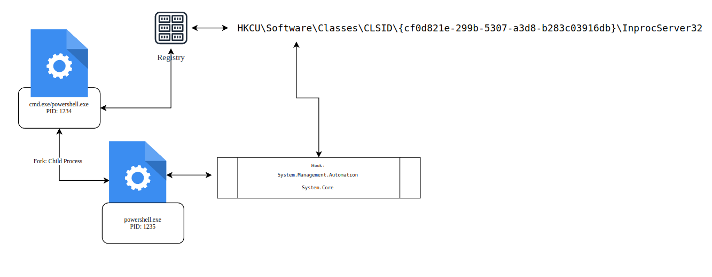

# Invisi-shell

Table of content:

  1. [DESCRIPTION](#description)
  2. [HOW IT WORKS](#how-it-works)
  3. [BYPASS AMSI DEFENDER AUDIT EVTX](#bypass-amsi-defender-audit-evtx)
  4. [SOURCE CODE ANALISYS](#source-code-analisys)
  5. [IOCS](#iocs)
  6. [COMPLEMENTARY INFORMATION](#complementary-information)

## DESCRIPTION

```
Hide your powershell script in plain sight! Invisi-Shell bypasses all of Powershell security features and Opertive system audit (powershell)
```

## HOW IT WORKS

The Invisi-shell project should be launched from an specific process on the wondows operative system:
```
  1.cmd.exe
  2.powrshell.exe
```
There are two diferent ways for launch the Invisi-shell project, with Administrative or non administrative privileges.It should be launched using the following scripts:
```
  1.Admin: RunWithPathAsAdmin.bat
  2.Not Admin: RunWithRegistryNonAdmin.bat
 ```
The previous bat script prepare the Operative system for the execution of the child process Powershell. 
The communication functions of the child process related with AMSI validation and Operative system Audit are hooked by the InvisiShellProfiler.dll dinamyc library using the public windows  [System.Management.Automation] and [System.Core] libraries.



Bat script example that prepare the operative system loading dinamyc library in the windows register:


Opertive system registers validation:


## BYPASS AMSI DEFENDER AUDIT EVTX

AMSI Architecture and Invi-shell hook bypass:


AMSI Sw level:


Bypass windows defender enable evidences:


## SOURCE CODE ANALISYS

[Invi-shell (resources/Repository)](https://github.com/OmerYa/Invisi-Shell)


## IOCS

```
Register: 
-Harcoded unique identifier object: {cf0d821e-299b-5307-a3d8-b283c03916db}
dll name: 
-InvisiShellProfiler.dll
```

### COMPLEMENTARY INFORMATION

[AMSI-Powershell bypass](https://www.mdsec.co.uk/2018/06/exploring-powershell-amsi-and-logging-evasion/)

[Microsoft ](https://learn.microsoft.com/es-es/windows/win32/amsi/how-amsi-helps)

[Rasta-mouse](https://github.com/rasta-mouse/AmsiScanBufferBypass)

[Rasta.mouse](https://rastamouse.me/memory-patching-amsi-bypass/)

[PoC f0ns1](https://github.com/f0ns1/antivirus_bypass_powershell)
