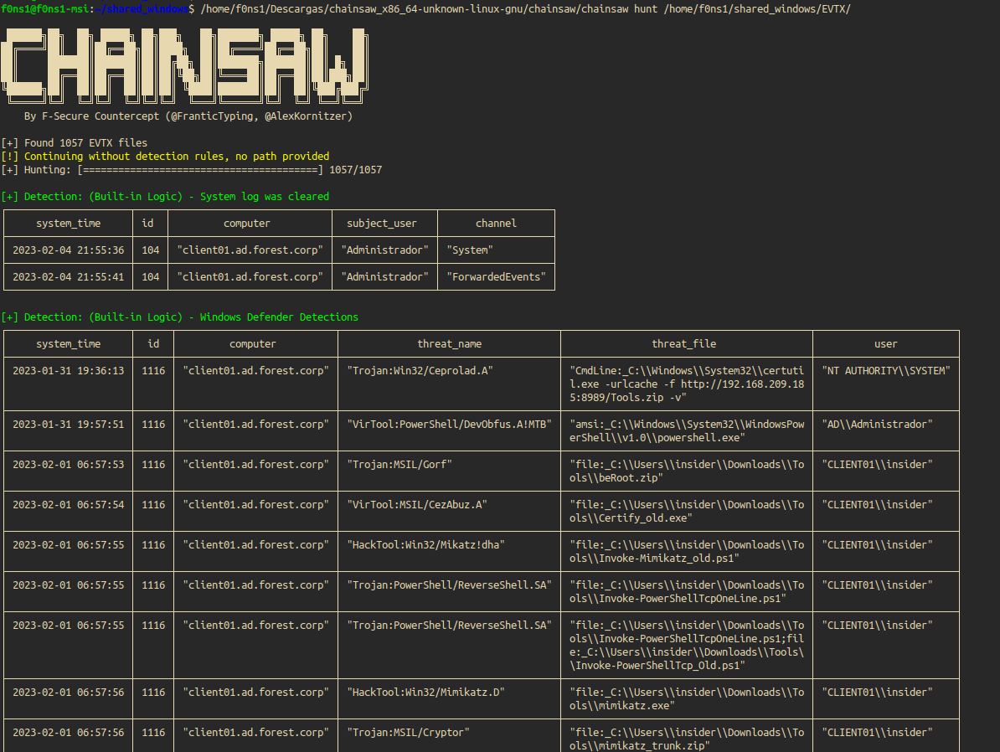
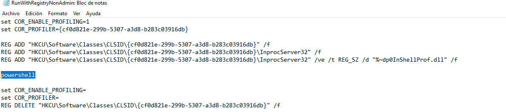
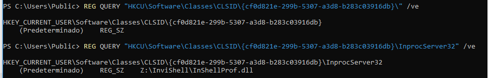
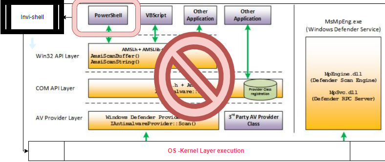
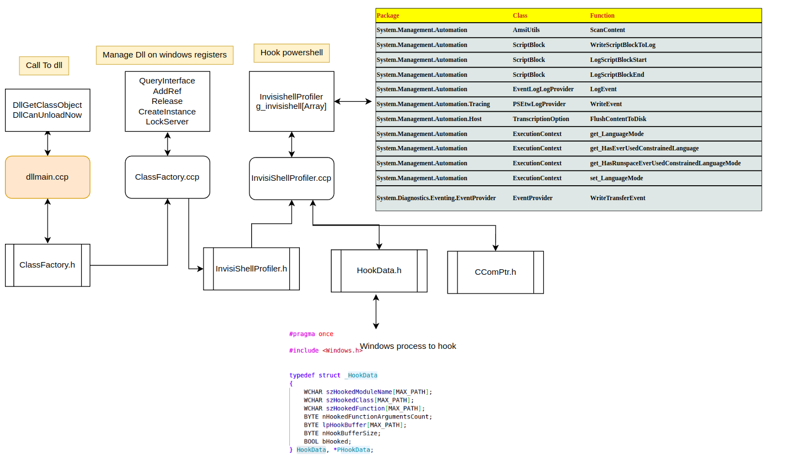

## BYPASS DEFENDER



## Invisi-shell

[Invi-shell (resources/Repository)](https://github.com/OmerYa/Invisi-Shell)

```
Hide your powershell script in plain sight! Invisi-Shell bypasses all of Powershell security features and Opertive system audit (resources/powershell)
```
Source code script Inject DLL:



Opertive system registers:



## BYPASS AMSI + DEFENDER + AUDIT EVTX

AMSI Architecture and Invi-shell hook bypass:



AMSI Sw level:


## SOURCE CODE ANALISYS



## IOCS

```
Register: 
-Harcoded unique identifier object: {cf0d821e-299b-5307-a3d8-b283c03916db}
dll name: 
-InvisiShellProfiler.dll
```

### Complementary information

[AMSI-Powershell bypass](https://www.mdsec.co.uk/2018/06/exploring-powershell-amsi-and-logging-evasion/)

[Microsoft ](https://learn.microsoft.com/es-es/windows/win32/amsi/how-amsi-helps)

[Rasta-mouse](https://github.com/rasta-mouse/AmsiScanBufferBypass)

[Rasta.mouse](https://rastamouse.me/memory-patching-amsi-bypass/)

[PoC f0ns1](https://github.com/f0ns1/antivirus_bypass_powershell)
