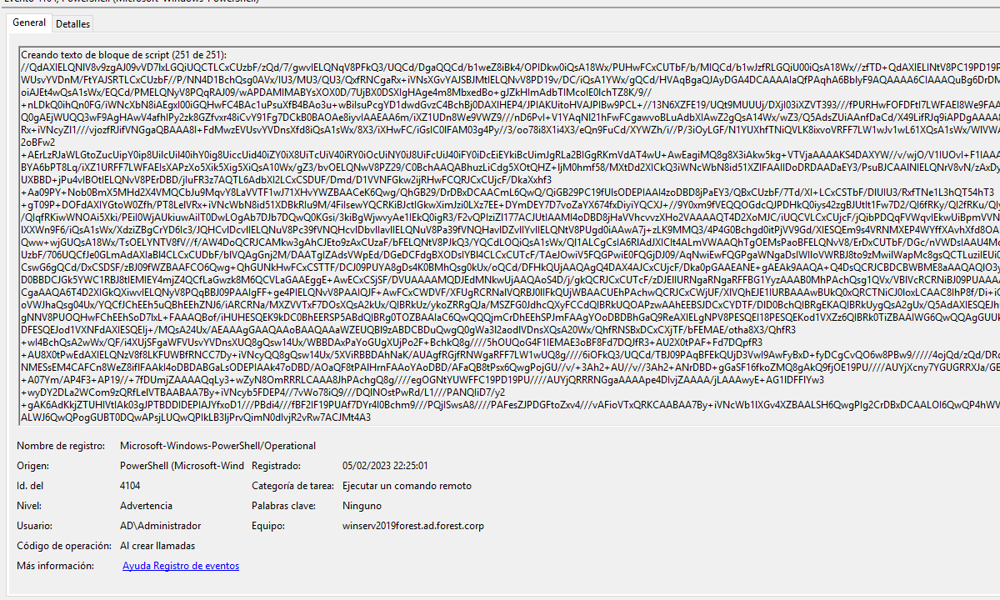

# 1. Privilege Escalation

## 1.2 Fileless Enumeration

### Output


### Evidences

Windows Active Directory side (resources/powershell enumeration):
```
EVTX:
4104 x 49

```


Windows client side (resources/python server):
```
EVTX:
5156

```


### 1.3 Fileless Privilege Escalation

### Output

### Evidences

```
RegRipper

```


### 1.4 PSRemoting

### Output

### Evidences

```
EVTX:

```


# 2 Dump Credentials

### Output


### Evidences

```
EVTX:

```



