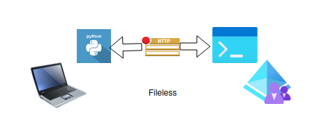
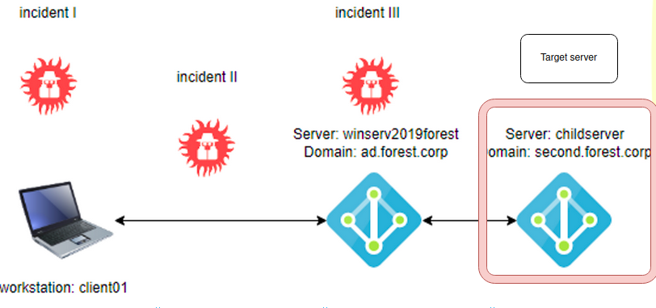

# Dump Credentials



## Table of content

  1. [SECURITY EVENTS TRIAGE](#security-events-triage)
  2. [VULNERABILITY DETECTION](#vulnerability-detection)  
  3. [CONSLUSIONS](#conclusions)


## SECURITY EVENTS TRIAGE

### Evidences

After security events triage, the most important evidences could be find on the following list :

```
EVTX:

4104 x251
```


## VULNERABILITY DETECTION

There isn't vulnerabilities on this section.


## CONCLUSIONS

The attacker with Administrative rights can dump the Lsass.exe process on the Active Directory server:


Maybe, one of these users could belong to the trusted Forest Active directory domain?




# TO BE CONTINUE ....
