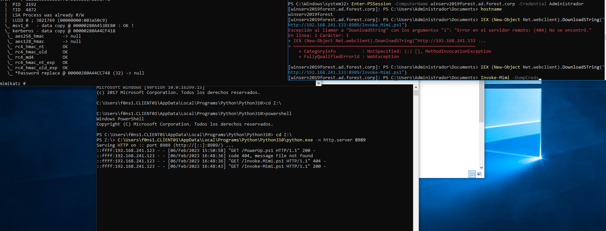
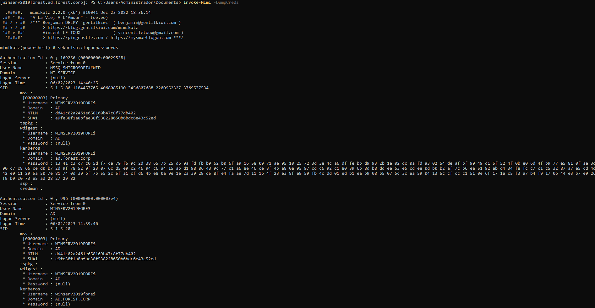

# Dump Credentials


## Table of content

  1. [SECURITY EVENTS TRIAGE](#security-events-triage)
  2. [VULNERABILITY DETECTION](#vulnerability-detection)  
  3. [CONSLUSIONS](#conclusions)


## SECURITY EVENTS TRIAGE

### Evidences

```
EVTX:

```


## VULNERABILITY DETECTION





## CONCLUSIONS

