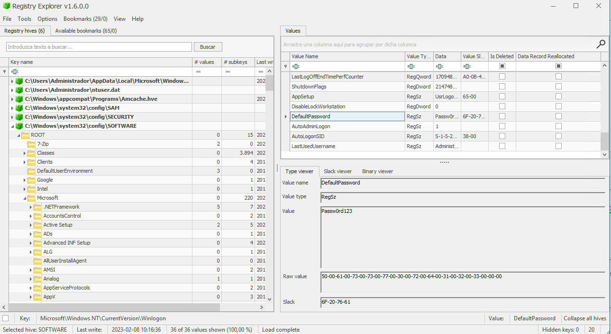
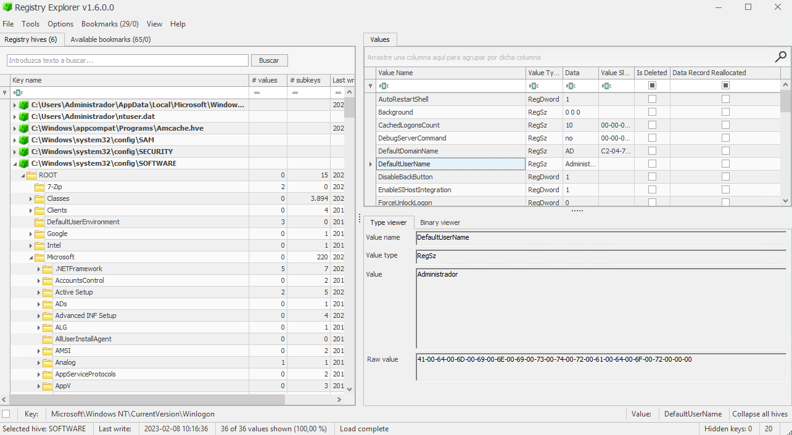

## Fileless Privilege Escalation

## Table of content

  1. [SECURITY EVENTS TRIAGE](#events-triage)
  2. [VULNERABILITY DETECTION](#vulnerability-detection)  
  3. [CONSLUSIONS](#conclusions)

## SECURITY EVENTS TRIAGE
### Evidences

```
Using Windows Registry
```
Default user credentials:


Default user Password:


## VULNERABILITY DETECTION

### Output


### 1.4 PSRemoting

### Output

### Evidences

```
EVTX:

```


## CONCLUSIONS 

