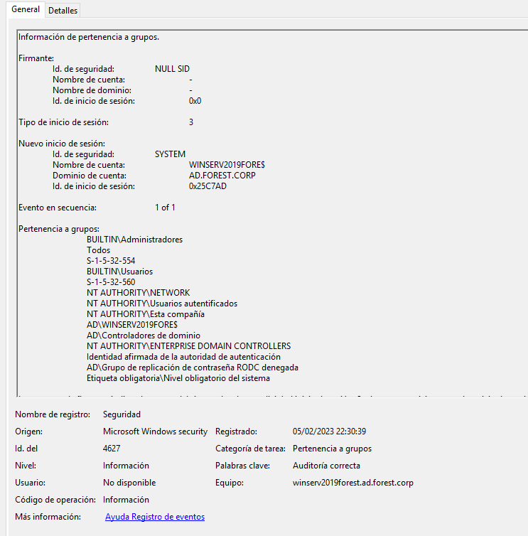

## Fileless Privilege Escalation

## Table of content

  1. [SECURITY EVENTS TRIAGE](#security-events-triage)
  2. [VULNERABILITY DETECTION](#vulnerability-detection)  
  3. [CONSLUSIONS](#conclusions)

## SECURITY EVENTS TRIAGE
## Table of content

  1.1 [CREDENTIALS DETECTION](#credentials-detection)
  
  1.2 [PSRemoting ACCESS](#psremoting-access) 

### CREDENTIALS DETECTION

### Evidences

In this section, on the Windows registry server path at HK Local Machine:

```
HKEY_LOCAL_MACHINE\SOFTWARE\Microsoft\Windows NT\CurrentVersion\Winlogon
```
It's possible to detect the specific values for the properties:

```
DefaultUserName
DefaultUserPassword
```
Defined by the Adminsitrator.

In order to perform a forensic analysis the Windows RegistryExplorer was executed on the afected server:
[Forensics Tools](Forensics.md)

Default user credentials:


Default user Password:


### PSRemoting ACCESS

### Evidences
After security events triage, the most important evidences could be find on the following list :
```
EVTX:
4672
4624
4627
```
New session created on the Active directory server for an Administrator user:


Validate assigned groups for the Administrator user:



The server assign the permissions of the groups that the Administrator user belong:


## VULNERABILITY DETECTION

The Default Autologon in the Operative System, allow to an attacker obtain the username and credentials on plaintext:


## CONCLUSIONS 

Configure a target server with Autologon credentials it's a Vulnerability, because any authenticate user could obtain it from registry
