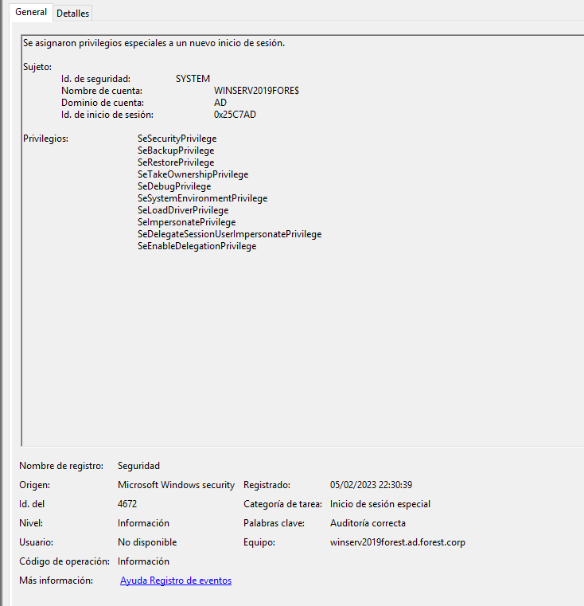

### 1.3 Fileless Privilege Escalation

### Output

### Evidences

```
Using Windows Registry
```
Default user credentials:


Default user Password:


### 1.4 PSRemoting

### Output

### Evidences

```
EVTX:

```



