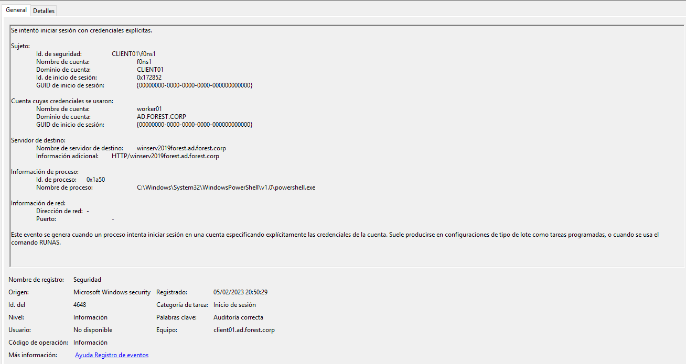
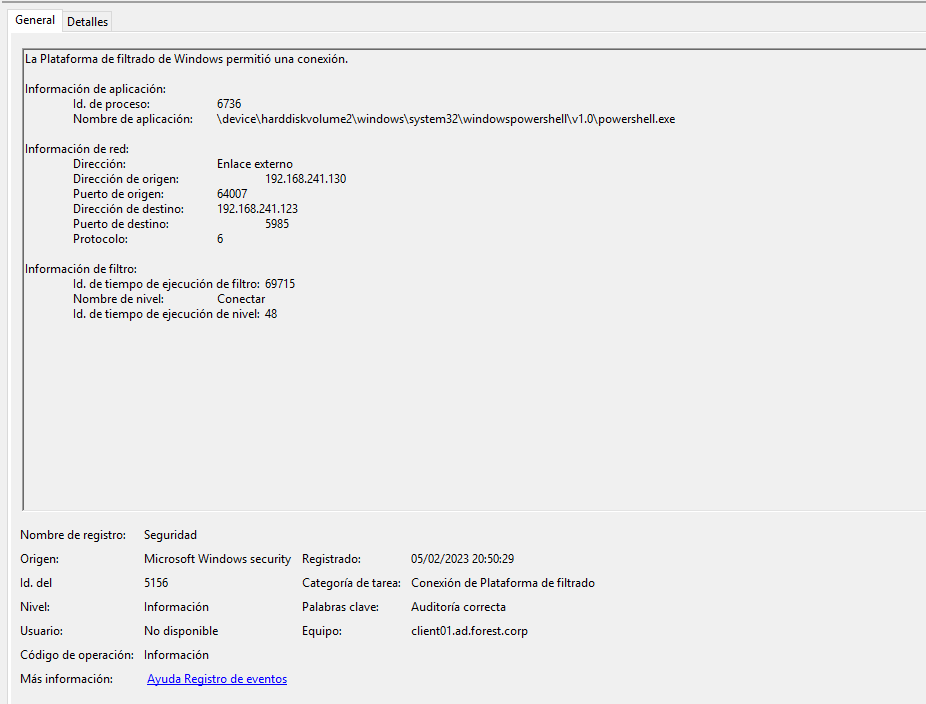
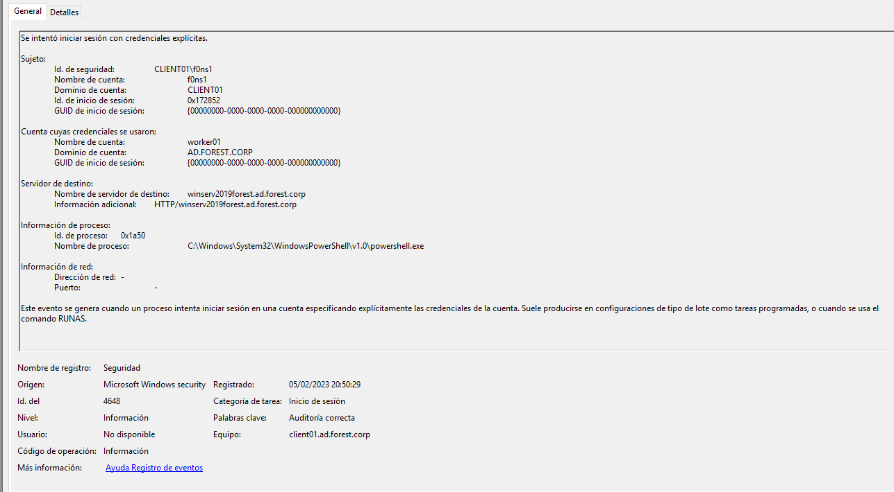
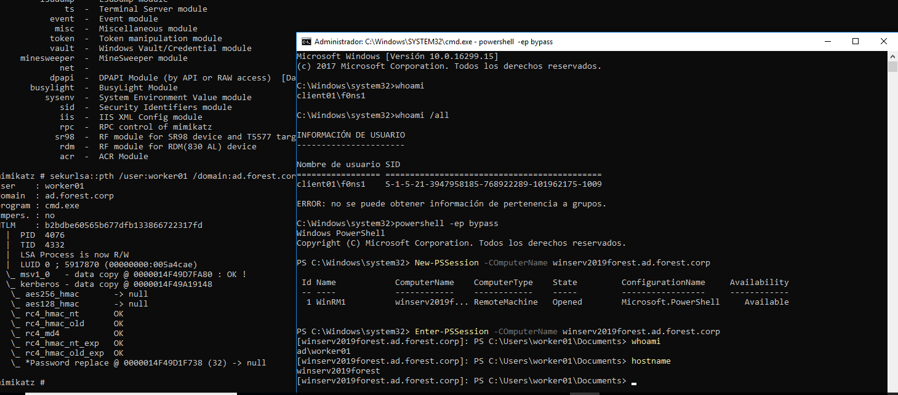

## ACCESS TO DOMAIN CONTROLLER

## Table of content

  1. [SECURITY EVENTS TRIAGE](#security-events-triage)
  2. [VULNERABILITY DETECTION](#vulnerability-detection)  
  3. [CONCLUSIONS](#conclusions)


## SECURITY EVENTS TRIAGE
```
EVTX: 
4648: Session Init
5158: Connection to platform
5158: Connection to platform
```






## VULNERABILITY DETECTION


## CONCLUSIONS


