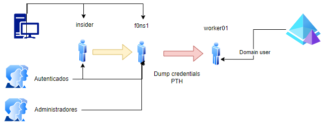

## ACCESS TO DOMAIN CONTROLLER

## Table of content

  1. [SECURITY EVENTS TRIAGE](#security-events-triage)
  2. [VULNERABILITY DETECTION](#vulnerability-detection)  
  3. [CONCLUSIONS](#conclusions)


## SECURITY EVENTS TRIAGE

After security events triage, the most important evidences could be find on the following list:

```
EVTX: 
4648: Session Init
5158: Connection to platform
5158: Connection to platform
```
The threat user [f0ns1] form operative system process [powershell] try to authenticate in domain controller [winserv2019forest.ad.forest.local], using the  impersonation credentials of user [AD\worker01]:


Cennection beteewn local server and domain controller IP 192.168.241.130 at port 5985:


## VULNERABILITY DETECTION

Exploit the previous vulnerability [PasstheHash] in order to obtain access without authentication to the Windows Active Directory:


## CONCLUSIONS

There aren't vulnerabilities on this section, but It si possible determine the lateral movement of the threat actor to the Domain controller via PSRemotting / WinRM protocol:



