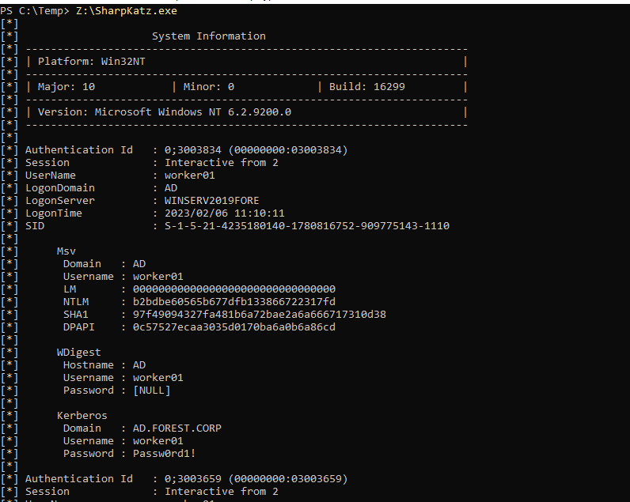
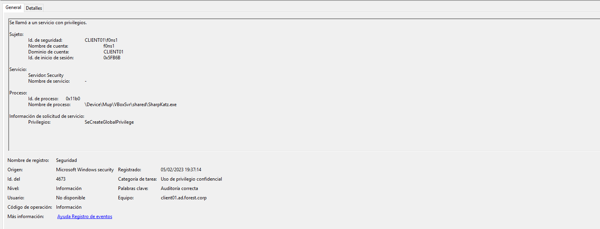
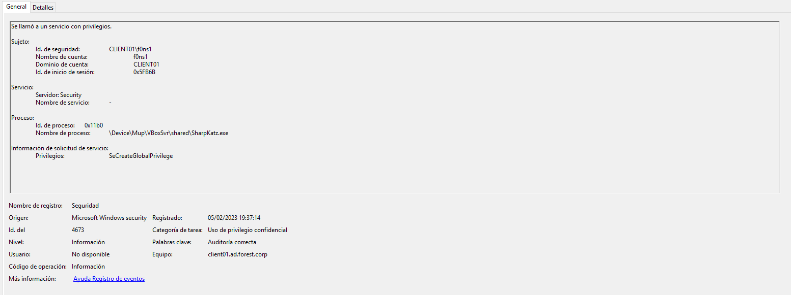
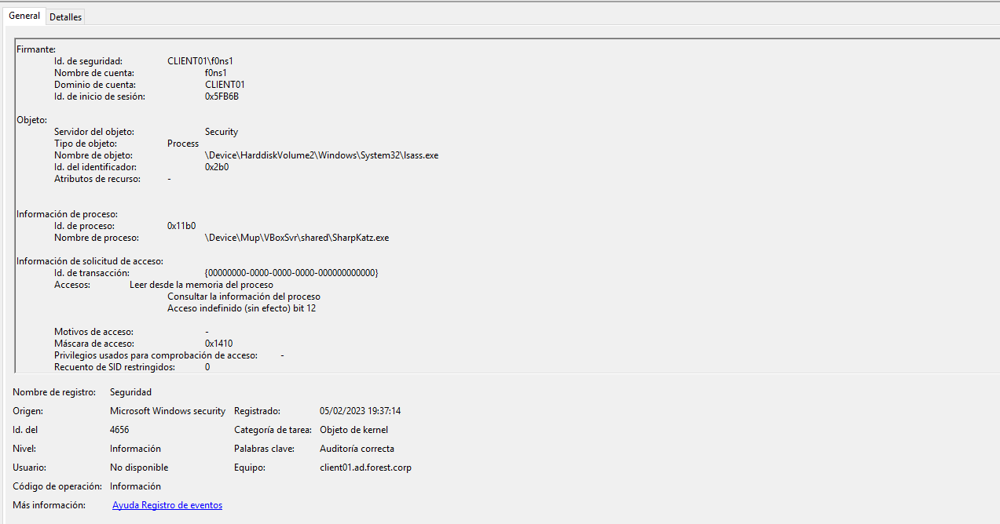
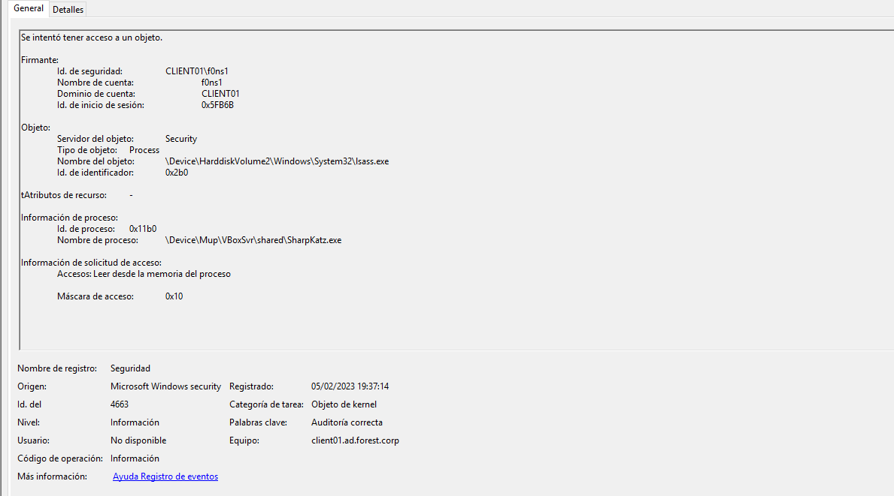
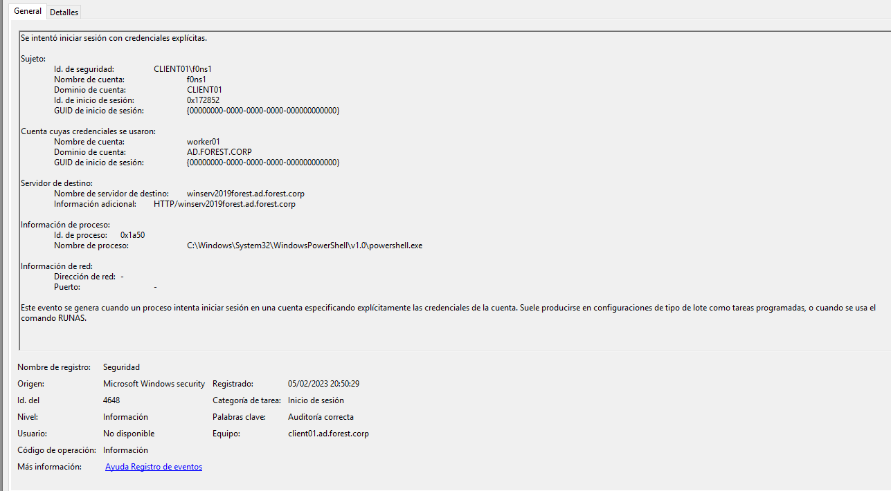

## 1. Dump credentials (resources/Shapkatz.exe) detection
```
EVTX: 
4688: Process execution 
4673: Use of confidential privilege
4690: Identifiers manipulation
4658, 4653,4663, 4658: Kernel Objects access 
4690: Identifiers manipulation
4658, 4653, 4663: kernel Object access
4689: End of processs
```
### 1.1 Output


### 1.2 Evidences












## 2. PassTheHash Laterarl movement

### 2.1 Use mimikatz: f0ns1 (resources/Local System Administrator) --> worker01 (resources/Domain ad.forest.corp user)

```
EVTX:
4688: process creation
4673: Use of confidential privilege
4611: Extension of security system
4673: Use of confidential privilege
4624: Session Init
4627: Belong to groups
4672: Special session init
4688: Process creation
4690: Identifiers manipulation
4658, 4656, 4663: Kernel objects
4690: Identifiers manipulation
4658, 4656, 4663: Kernel objects
```
### 2.2 Output

### 2.3 Evidenes


## 3. Use PSRemoting and access to domain controller (resources/whithout logon)

```
EVTX: 
4648: Session Init
5158: Connection to platform
5158: Connection to platform
```


### 3.2 Output


### 3.3 Evidences





