# DUMP CREDENTIALS

## Table of content

  1. [SECURITY EVENTS TRIAGE](#security-events-triage)
  2. [VULNERABILITY DETECTION](#vulnerability-detection)  
  3. [CONCLUSIONS](#conclusions)


### SECURITY EVENTS TRIAGE

After security events triage, the most important evidences could be find on the following list:

```
EVTX: 
4688: Process execution 
4673: Use of confidential privilege
4690: Identifiers manipulation
4658, 4653,4663, 4658: Kernel Objects access 
4690: Identifiers manipulation
4658, 4653, 4663: kernel Object access
4689: End of processs
```

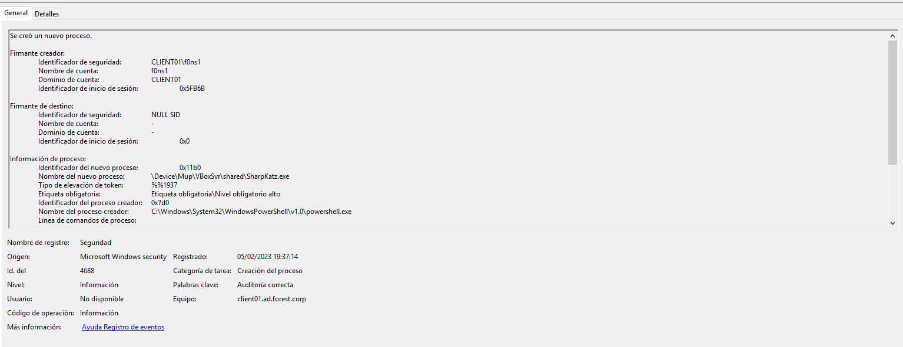

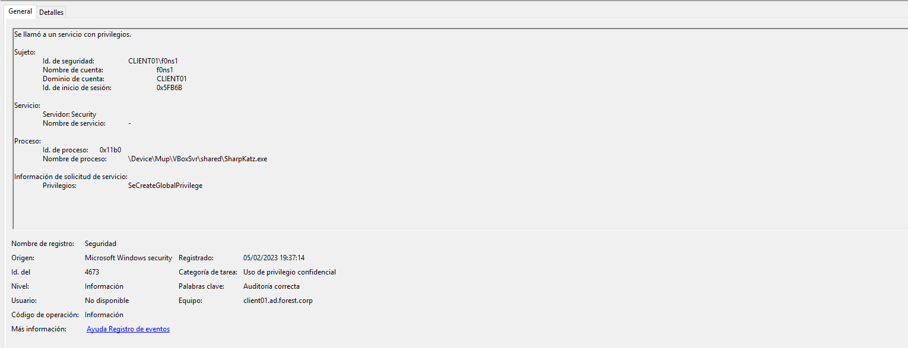

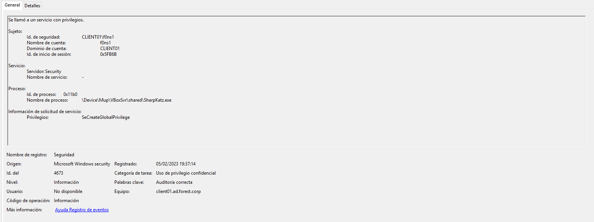

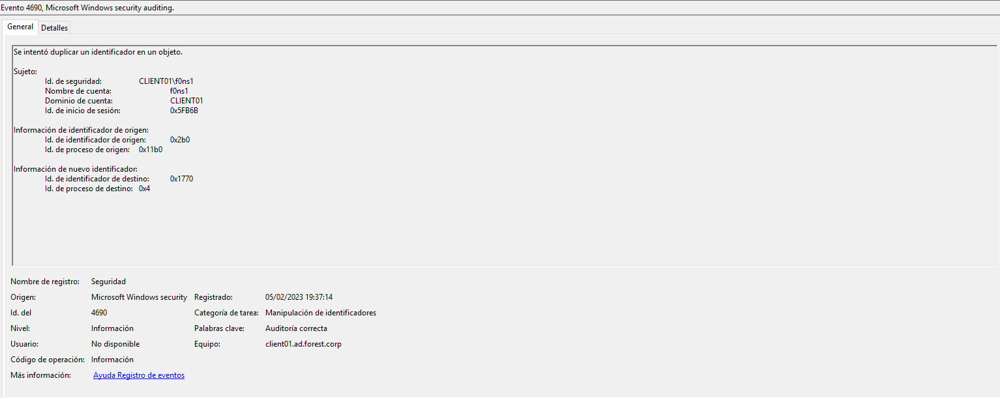


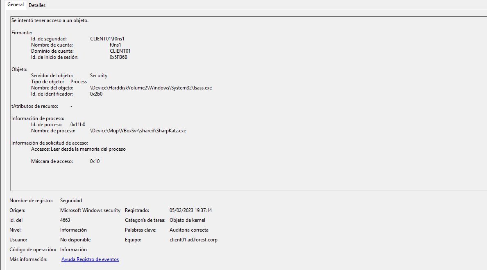

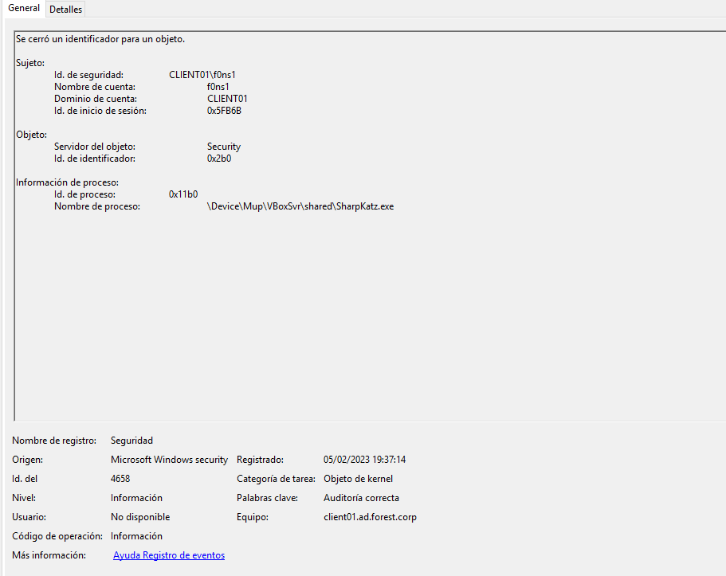

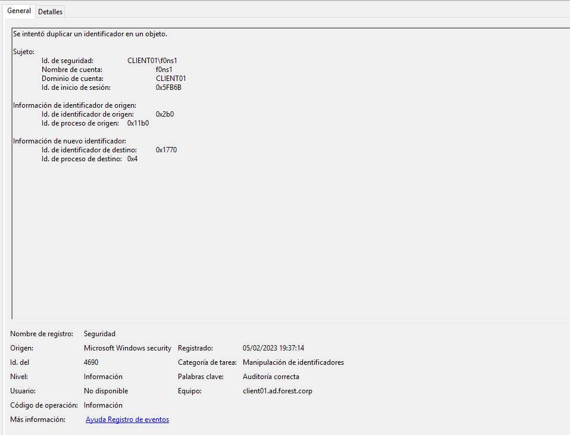

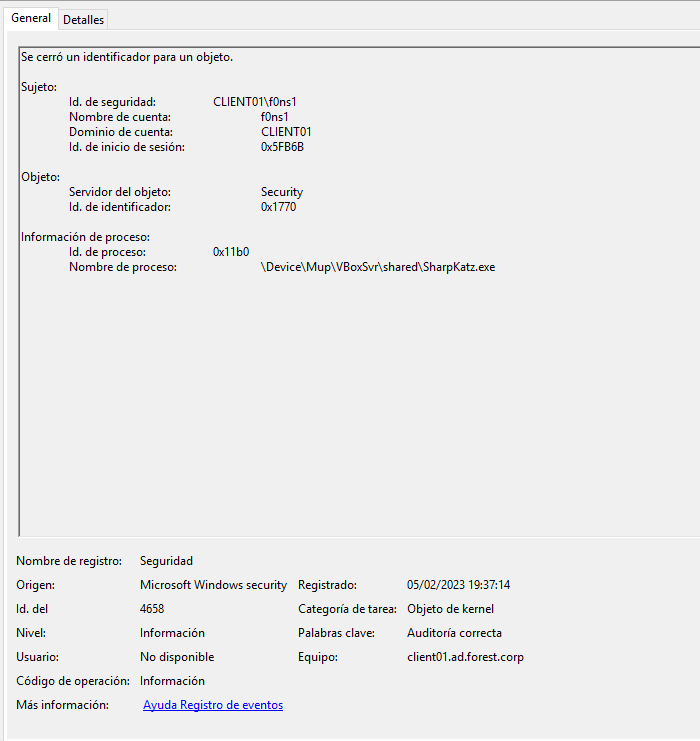

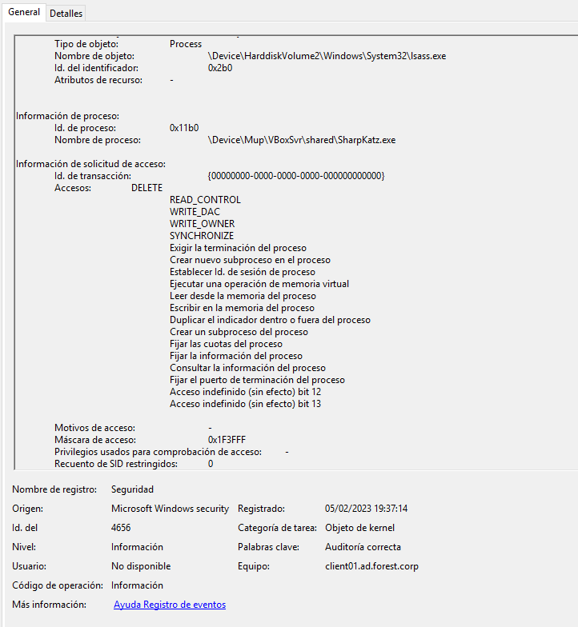

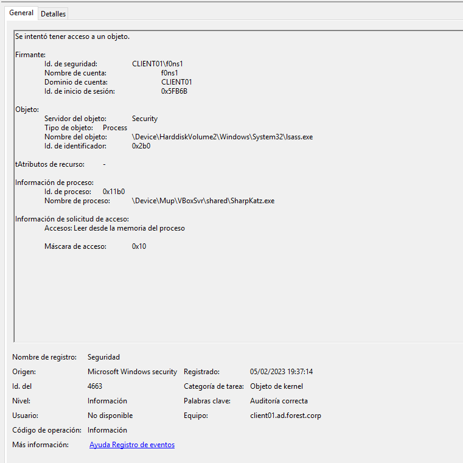

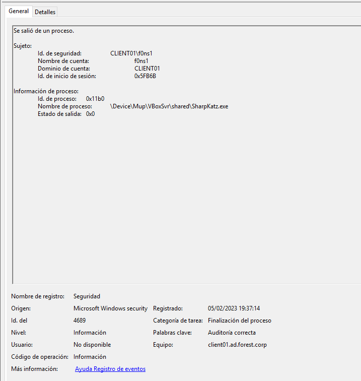

## VULNERABILITY DETECTION

One of domain users [AD\worker01] was logged on the target server and the account've never been logoff, for this reason an authenticated local users with Administrator privileges on the workstation could dump the LSASS process on of the Operative System.
This process contains on dynamic memory the plaintext credentials and ntlm hash of the user:

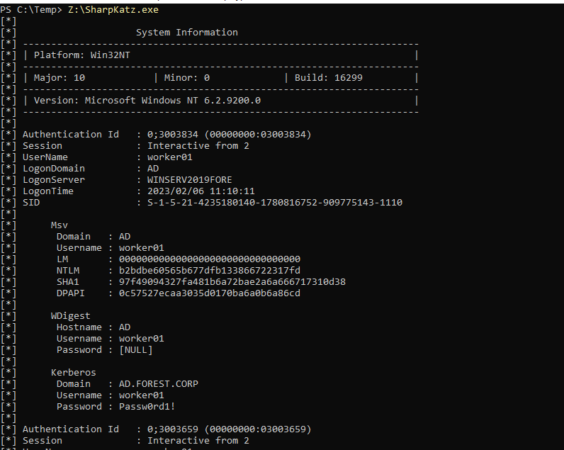

## CONCLUSIONS

The local [insider] user spawn a terminal with [f0ns1] local user Administrator. After dump  credentials the [f0ns1] could impersonate to domain user [AD\worker01.

