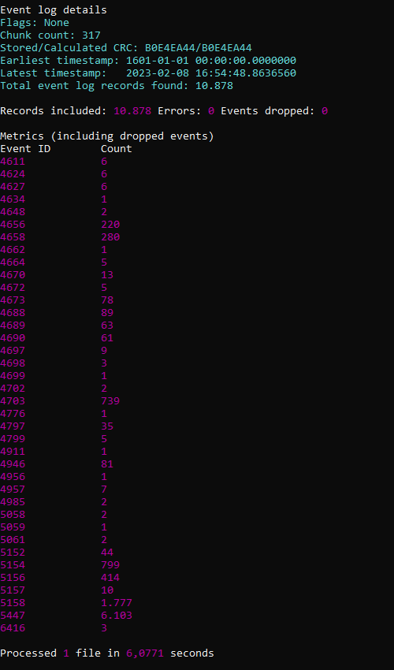

# DUMP CREDENTIALS

## Table of content

  1. [EVIDENCES RECOLECTION](#evidences-recolection)
  2. [EVENTS TRIAGE](#events-triage)
  3. [VULNERABILITY DETECTION](#vulnerability-detection)  
  4. [CONSLUSIONS](#conclusions)


### EVIDENCES RECOLLECTION

In order to perform a forensic analysis the Windows Live Response was executed on the afected server:
[Forensics Tools](Forensics.md)

Extract security events from Operative system:

```
wevtutil.exe epl Security Z:\local_priv.evtx
```

Parse security events:

```
Z:\EvtxECmd\EvtxECmd.exe -f Z:\local_priv.evtx --csv Z:\  --csvf local_priv_events.csv
```


Extract System events from Operative system:

```
wevtutil.exe epl System Z:\local_priv_system.evtx
```

Parse System events:

```
Z:\EvtxECmd\EvtxECmd.exe -f Z:\local_priv_system.evtx --csv Z:\  --csvf local_priv_events_system.csv
```


### EVENTS TRIAGE
```
EVTX: 
4688: Process execution 
4673: Use of confidential privilege
4690: Identifiers manipulation
4658, 4653,4663, 4658: Kernel Objects access 
4690: Identifiers manipulation
4658, 4653, 4663: kernel Object access
4689: End of processs
```
### 1.1 Output


### 1.2 Evidences


## VULNERABILITY DETECTION


## CONSLUSIONS

