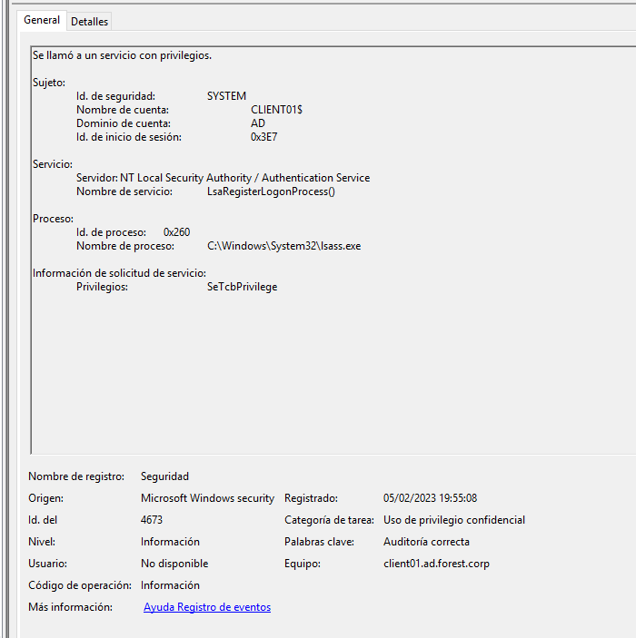
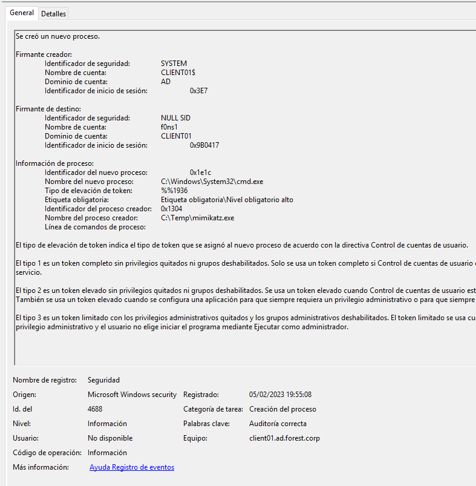

## LATERAL MOVEMENT

## Table of content

  1. [SECURITY EVENTS TRIAGE](#security-events-triage)
  2. [VULNERABILITY DETECTION](#vulnerability-detection)  
  3. [CONCLUSIONS](#conclusions)


### SECURITY EVENTS TRIAGE

### Use mimikatz: f0ns1 (resources/Local System Administrator) --> worker01 (resources/Domain ad.forest.corp user)

```
EVTX:
4688: process creation
4673: Use of confidential privilege
4611: Extension of security system
4673: Use of confidential privilege
4624: Session Init
4627: Belong to groups
4672: Special session init
4688: Process creation
4690: Identifiers manipulation
4658, 4656, 4663: Kernel objects
4690: Identifiers manipulation
4658, 4656, 4663: Kernel objects
```








## VULNERABILITY DETECTION


## CONCLUSIONS


