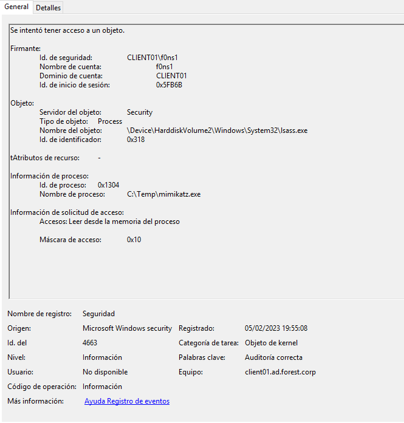
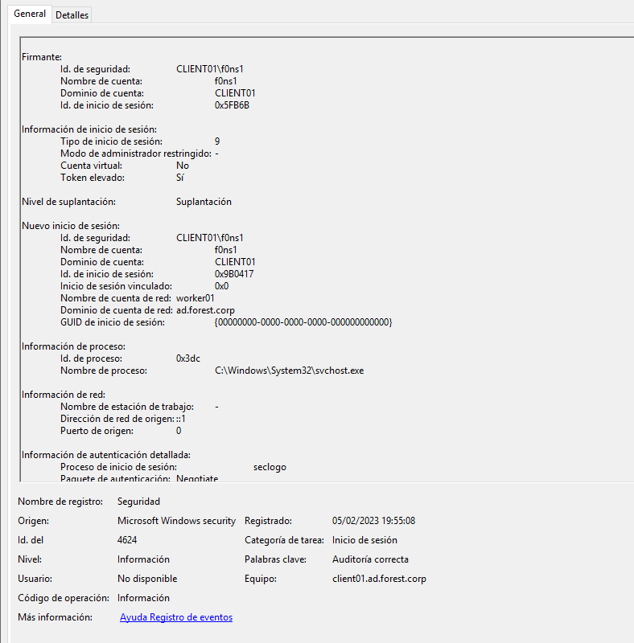
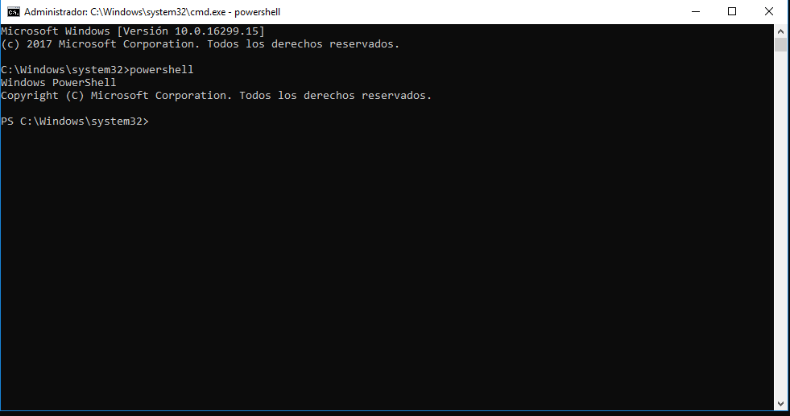

## LATERAL MOVEMENT

## Table of content

  1. [SECURITY EVENTS TRIAGE](#security-events-triage)
  2. [VULNERABILITY DETECTION](#vulnerability-detection)  
  3. [CONCLUSIONS](#conclusions)


### SECURITY EVENTS TRIAGE

### Use mimikatz: f0ns1 (resources/Local System Administrator) --> worker01 (resources/Domain ad.forest.corp user)

After security events triage, the most important evidences could be find on the following list:

```
EVTX:
4688: process creation
4673: Use of confidential privilege
4611: Extension of security system
4673: Use of confidential privilege
4624: Session Init
4627: Belong to groups
4672: Special session init
4688: Process creation
4690: Identifiers manipulation
4658, 4656, 4663: Kernel objects
4690: Identifiers manipulation
4658, 4656, 4663: Kernel objects
```
The parent process [powershell.exe] launched by the threat user [f0ns1], execute the child process with the binary mimikatz.exe:


The process of the binary [mimikatz.exe] use the privilege SeTcbPrivilege:


The [mimikatz.exe] try to manipulate objects:


The process [mimikatz.exe] call to process [lsass.exe]:




The Operative System launch the Secondary Logon service


The process [lsass.exe] use the service LsaRegisterLogonProcess() for authentication process launched by the target worksattion [CLIENT01]:


The process [svchost.exe] launched by user [f0ns1] impersonate privileges with user [worker01] that belong to domain ad.forest.corp:



Local groups asigned to user [f0ns1] on the workstation [CLIENT01]:


Privileges for the user:


The parent process [powershell.exe] that launch the child process [mimikatz.exe], finally spawn a new console [cmd.exe] with the [AD\worker01] privileges using a TGS authentication of kerberos:  


## VULNERABILITY DETECTION

The threat actor [CLIENT01\insider] using the new local administrator user [CLIENT01\f0ns1], was detected using Pass The hash technique in order to impersonate the user of domain [AD\worker01]:



## CONCLUSIONS

There aren't vulnerabilities on this section, but It si possible determine the impersonation of the threat actor to the domain user via [mimikatz.exe] tool:


