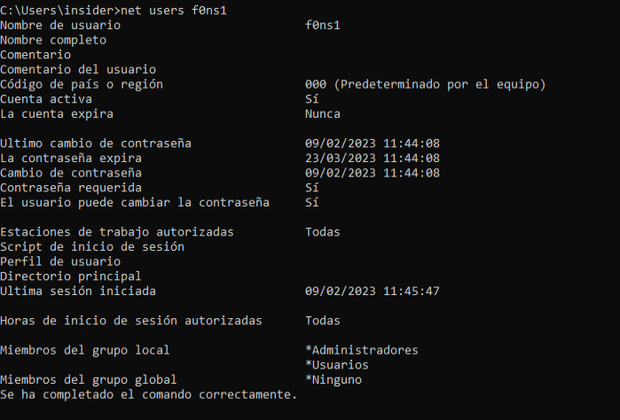

# Detection
* For this study is requiered update the GPO policy on the target or in the Domain controller with the following configuration:
[Enable Events 4688](https://learn.microsoft.com/en-us/windows-server/identity/ad-ds/manage/component-updates/command-line-process-auditing)

This configuration enable the audit of process creation command line with EventID 4688.

# Table of Contents

  1. [ENUMERATION](#enumeration)
  2. [PRIVILEGE ESCALATION](#privilege-escalation)


## ENUMERATION

During the enumeration process the attacker used Invi-shell with Powershell. For this reason is not possible detect the enumeration process across the operative system:

[Anex A (resources/Invi-shell studied case)](invi-shell.md)

## PRIVILEGE ESCALATION:

## Table of content

  1. [EVIDENCES RECOLECTION](#evidences-recolection)
  2. [EVENTS TRIAGE](#events-triage)
  3. [VULNERABILITY DETECTION](#vulnerability-detection)  
  4. [CONSLUSIONS](#conclusions)

### EVIDENCES RECOLLECTION

In order to perform a forensic analysis the Windows Live Response was executed on the afected server:
[Forensics Tools](Forensics.md)

Extract security events from Operative system:

```
wevtutil.exe epl Security Z:\local_priv.evtx
```

Parse security events:

```
Z:\EvtxECmd\EvtxECmd.exe -f Z:\local_priv.evtx --csv Z:\  --csvf local_priv_events.csv
```


Extract System events from Operative system:

```
wevtutil.exe epl System Z:\local_priv_system.evtx
```

Parse System events:

```
Z:\EvtxECmd\EvtxECmd.exe -f Z:\local_priv_system.evtx --csv Z:\  --csvf local_priv_events_system.csv
```


### EVENTS TRIAGE

After recollection is performed with the Windows Recollection live tool, the user latest executive processes on the operative system was provided as output file. And is possible to detect the execution of the binary by the service:


The event that verify that service executed the binary:


Evidences of latest vulnerable service execution, with output error status:

 


Finally, is possible detect in the user "insider" hives a couple of evidence:

  1. Modification of binary executed by vulnerable service "worksop_vuln". Using the Reg Ripper sofware available on the "forensics Tool reference" [Forensics Tools](Forensics.md):


  2. The evidence of the threat user when the operative system load the Invisi-Shell on the windows registers. Using the Register software avaliable on the "forensics Tool reference" [Forensics Tools](Forensics.md):


### VULNERABILITY DETECTION 

It's possible too, detect the attack vector:

```
The target service "worksop_vuln", execute a binary file that could be modified for all authenticated users at the operative system.

```


The source code of the modified service, after and before that the threat actor access to the binary:


### CONCLUSIONS

From detection side, it's posible determine that the user [insider] use the invisi-shell in order to cover the clues, for the operative system enumeration and modifications performed for the privilege escalation.

But It's possible, detect that the user access and modified the content of the binary:

``` 
C:\Users\Public\binary.bat
```

This binary, was executed by the service with a final error status execution after opertive system reboot.

On the one side, the events recordered by the operative system do not cover the new local user creation and the local administrator privileges asigned, by the service "worksop_vuln" executed during the System startup, but in the output data of the windows Live Response Tool, is  possible detect all the users and permissions on the Operative system.

On the other side the Operative System report the creation date od the new user f0ns1 that belong to the Administradores local group:


 


