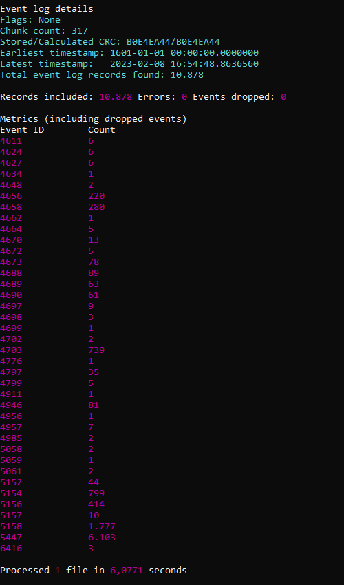
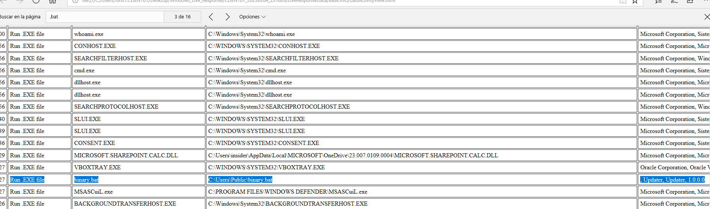
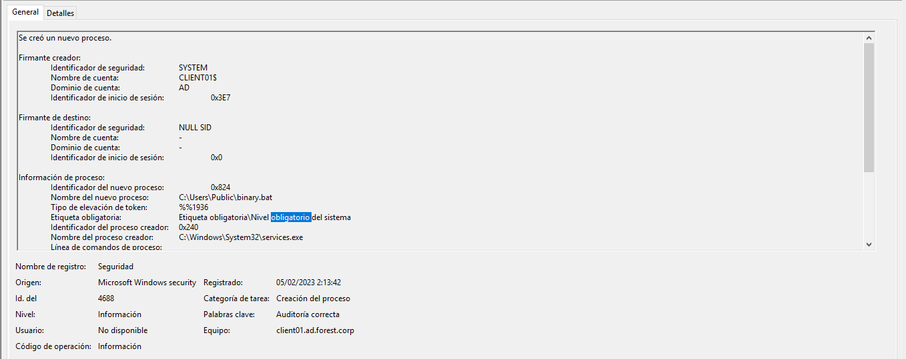
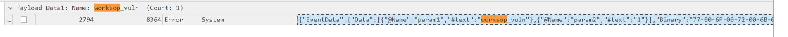
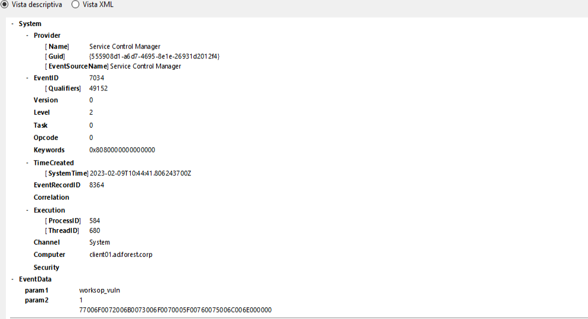
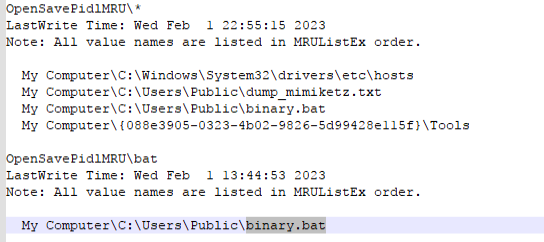
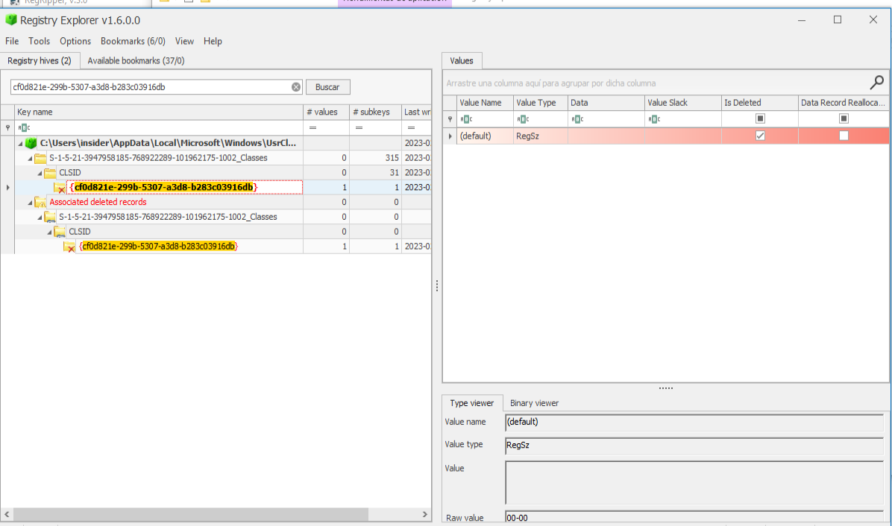
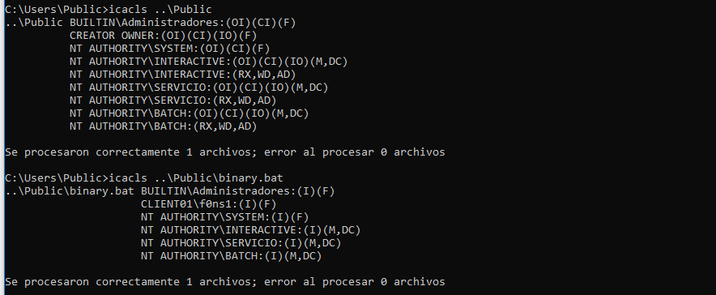
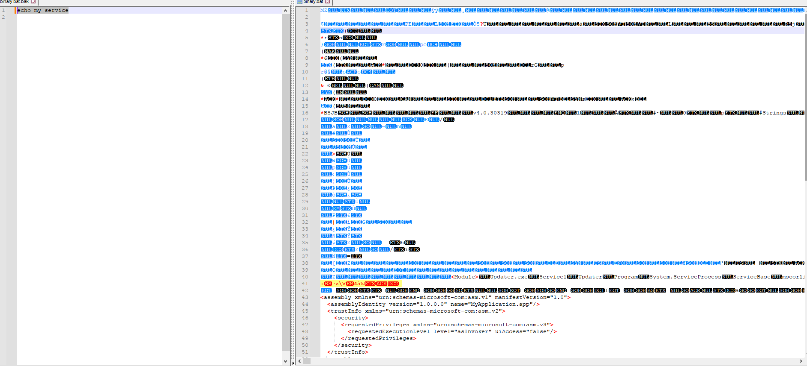

# Detection
* For this study is requiered update the GPO policy on the target or in the Domain controller with the following configuration:
[Enable Events 4688](https://learn.microsoft.com/en-us/windows-server/identity/ad-ds/manage/component-updates/command-line-process-auditing)

This configuration enable the audit of process creation command line with EventID 4688.

# Table of Contents

  1. [ENUMERATION](#enumeration)
  2. [PRIVILEGE ESCALATION](#privilege-escalation)


## ENUMERATION

During the enumeration process the attacker used Invi-shell with Powershell. For this reason is not possible detect the enumeration process across the operative system:

[Anex A (resources/Invi-shell studied case)](invi-shell.md)

## PRIVILEGE ESCALATION:

## Table of content

  1. [EVIDENCES RECOLECTION](#evidences-recolection)
  2. [EVENTS TRIAGE](#events-triage)
  3. [VULNERABILITY DETECTION](#vulnerability-detection)  
  4. [CONSLUSIONS](#conclusions)

### EVIDENCES RECOLLECTION

In order to perform a forensic analysis the Windows Live Response was executed on the afected server:
[Forensics Tools](Forensics.md)

Extract security events from Operative system:

```
wevtutil.exe epl Security Z:\local_priv.evtx
```

Parse security events:

```
Z:\EvtxECmd\EvtxECmd.exe -f Z:\local_priv.evtx --csv Z:\  --csvf local_priv_events.csv
```


Extract System events from Operative system:

```
wevtutil.exe epl System Z:\local_priv_system.evtx
```

Parse System events:

```
Z:\EvtxECmd\EvtxECmd.exe -f Z:\local_priv_system.evtx --csv Z:\  --csvf local_priv_events_system.csv
```


### EVENTS TRIAGE

After recollection is performed the Windows Reollection live tool provide to the user the lastest, process executed on the operative system. And is possible to detect the execution of the binary by the service across the operative system:



The event that verify that service exected the binary:




Evtx evidences of new user group inclusion:

 



Finally is possible detect reviewing the hives of the insider user a couple of evidences:

  1. Modification of binary server. Using the Reg Ripper sofware available on the forensics Tool reference [Forensics Tools](Forensics.md):




  2. The threat user load the Invisi-Shell on the windows registers. Using the Register software avaliable on the forensics Tool reference [Forensics Tools](Forensics.md):



### VULNERABILITY DETECTION 

Detected attack vector:

```
The target service execute a binary process that could be modified for all authenticated users at the operative system.

```



The source code of the modified service, after and before the threat actor access to the oeprative system:




### CONCLUSIONS

From de tection side, it's posible determine that the user [insider] use the invisi-shell in order to cover the clues for the operative system enumeration and modifications performe for the privilege escalation.

But it's possible detect that the user access and modified the content of the binary:
``` 
C:\Users\Public\binary.bat
```

This binary, was executed by the service with a final error status execution after opertive system reboot.

The  operative system event do not cover the new local user creation and the local administrator privileges asigned, but in the output data of the windows Live Response Tool, is  possible detect all the users and permissions on the Operative system .

 


