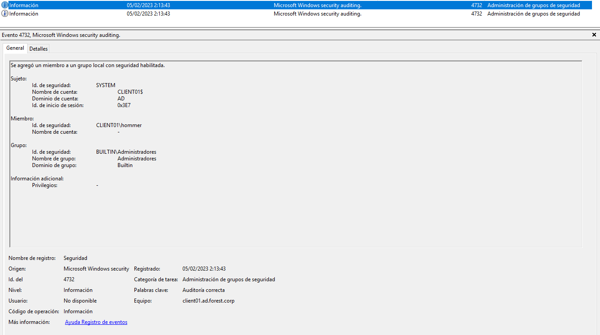
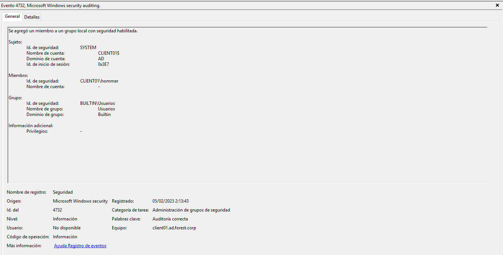

# Detection
* For this study is requiered update the GPO policy on the target or in the Domain controller with the following configuration:
[Enable Events 4688](https://learn.microsoft.com/en-us/windows-server/identity/ad-ds/manage/component-updates/command-line-process-auditing)

This configuration enable the audit of process creation command line with EventID 4688.

# Table of Contents

  1. [ENUMERATION](#enumeration)
  2. [PRIVILEGE ESCALATION](#privilege-escalation)


## ENUMERATION

During the enumeration process the attacker used Invi-shell with Powershell. For this reason is not possible detect the enumeration process across the operative system:

[Anex A (resources/Invi-shell studied case)](invi-shell.md)

## PRIVILEGE ESCALATION:

## Table of content

  1. [EVIDENCES RECOLECTION](#evidences-recolection)
  2. [EVENTS TRIAGE](#events-triage)
  3. [TIMELINE PROCESS EXECUTION](#timeline-process-execution)
  4. [VULNERABILITY DETECTION](#vulnerability-detection)  

### EVIDENCES RECOLECTION

In order to perform a forensics analysis the Windows Live Response was executed on the afected server:
[Forensics Tools](Forensics.md)

Extract security events from Operative system:

```
wevtutil.exe epl Security Z:\local_priv.evtx
```

Parse security events:

```
Z:\EvtxECmd\EvtxECmd.exe -f Z:\local_priv.evtx --csv Z:\  --csvf local_priv_events.csv
```


### EVENTS TRIAGE

After recollection is performed the Windows Reollection live tool provide to the user the lastest, process executed on the operative system. And is possible to detect the execution of the binary by the service across the operative system:


The event that verify that service exected the binary:


Evtx evidences of new user group inclusion:





Finally is possible detect reviewing the hives of the insider user a couple of evidences:

  1. Modification of binary server.


  2. Use of Invisi-Shell on the windows registers.


### TIMELINE PROCESS EXECUTION


### VULNERABILITY DETECTION 

Detected attack vector:

```
The target service execute a binary process that could be modified for all authenticated users at the operative system.

```


The source code of the modified service, after and before the threat actor access to the oeprative system:


